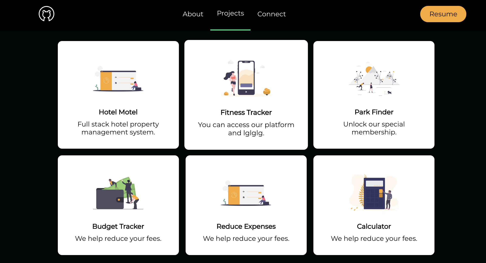

[![LinkedIn][linkedin-shield]][linkedin-url]
[![MIT License][license-shield]][license-url]
[![Portfolio][portfolio-shield]][linkedin-url]


<!-- PROJECT LOGO -->
<br />
<p align="center">
  <a href="https://github.com/ClaireBohlen">
    
  </a>

  <h3 align="center">Claire Bohlen Portfolio</h3>

  <p align="center">
    Awesome React Portfolio!
    <br />
    <a href="https://https://github.com/ClaireBohlen/React-Update-Portfolio-2.0"><strong>Explore the Repo »</strong></a>
    <br />
    <br />
    <a href="https://clairebohlen.github.io/React-Update-Portfolio-2.0/">Live Demo</a>
    
   
  </p>
</p>


<!-- TABLE OF CONTENTS -->
<details open="open">
  <summary><h2 style="display: inline-block">Table of Contents</h2></summary>
  <ol>
    <li>
      <a href="#about-the-project">About The Project</a>
      <ul>
        <li><a href="#built-with">Built With</a></li>
      </ul>
    </li>
    <li>
      <a href="#getting-started">Getting Started</a>
      <ul>
        <li><a href="#prerequisites">Prerequisites</a></li>
        <li><a href="#installation">Installation</a></li>
      </ul>
    </li>
    <li><a href="#usage">Usage</a></li>
    <!-- <li><a href="#roadmap">Roadmap</a></li> -->
    <!-- <li><a href="#contributing">Contributing</a></li> -->
    <li><a href="#license">License</a></li>
    <li><a href="#contact">Contact</a></li>
    <li><a href="#acknowledgements">Acknowledgements</a></li>
  </ol>
</details>


<!-- ABOUT THE PROJECT -->
## About The Project



I built this React Portfolio to display my latest projects and my design skills. I wanted a custom website where fellow engineers and employers can get to know me a little better. Check out my contact section to get in touch.

Here's why:
* Your time should be focused on creating something amazing. A project that solves a problem and helps others
* You shouldn't be doing the same tasks over and over like creating a README from scratch
* You should element DRY principles to the rest of your life :smile:

A list of commonly used resources that I find helpful are listed in the acknowledgements.


### Built With
<!-- * [Laravel](https://laravel.com) -->
* [React](https://reactjs.org/)


<!-- GETTING STARTED -->
## Getting Started

Before cloning down this repo, please checkout below 👇

### Prerequisites

This will be pretty easy but make sure you install Node Package Manager.
<!-- Node Package Manager -->
* npm
  ```sh
  npm install npm@latest -g
  ```

### Installation

1. Clone the repo
   ```sh
   git clone https://github.com/ClaireBohlen/React-Update-Portfolio-2.0.git
   ```
2. Install NPM packages
   ```sh
   npm install
   ```


<!-- USAGE EXAMPLES -->
## Usage

If you are just starting out with React or you're looking for some inspiration for your portfolio, please feel free to use mine as an example.

<!-- LICENSE -->
## License

Distributed under the MIT License. See `LICENSE` for more information.


<!-- CONTACT -->
## Contact

Claire C. Bohlen - [@polarbear4321](https://twitter.com/polarbear4321_) - clairebohlen@gmail.com

Project Link: [https://github.com/github_username/repo_name](https://github.com/github_username/repo_name)


<!-- ACKNOWLEDGEMENTS -->
## Acknowledgements
* [React-scroll]()
* [React-icons]()
* [The Noun Project](https://thenounproject.com/)
* [README Template](https://fontawesome.com)
* [UnDraw](https://undraw.co/search)
* [Brain Design](https://www.youtube.com/channel/UCsKsymTY_4BYR-wytLjex7A)
* []()


<!-- MARKDOWN LINKS & IMAGES -->
<!-- https://www.markdownguide.org/basic-syntax/#reference-style-links -->

[portfolio-shield]: https://img.shields.io/badge/PORTFOLIO-URL-blueviolet
[portfolio-url]: https://clairebohlen.github.io/React-Update-Portfolio-2.0/


[license-shield]: https://img.shields.io/badge/LICENSE-MIT-blueviolet
[license-url]: https://github.com/github_username/repo/blob/master/LICENSE.txt

[linkedin-shield]: https://img.shields.io/badge/-LINKEDIN-blueviolet
[linkedin-url]: https://www.linkedin.com/in/claire-bohlen-63a4b5119/
